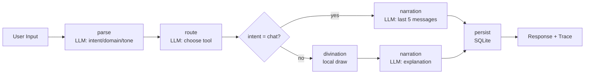

# Oracle's Choice: A SpoonOS Graph Agent for Divination + Chat

Oracle's Choice is a dual-mode oracle app built on the SpoonOS Graph Agent framework. It can hold empathetic, contextual conversations or run a structured divination flow on demand. The core idea is to make spiritual-style interactions more explainable, traceable, and flexible, instead of forcing a draw for every message.

This project is built for the SPARK AI Hackathon:
- https://github.com/CasualHackathon/SPARK-AI-Hackathon

## Screenshots


## Why This Project

Most divination apps treat every input as a request for a ritual. That breaks real conversations. People often want to vent, reflect, or ask for guidance without a forced draw. Oracle's Choice solves this by offering:

- **Chat mode** for natural, contextual dialogue
- **Divination mode** for explicit, structured readings
- **Auto-intent detection** when the user does not force a divination

## Core Features

- **Dual mode**: chat or divination, chosen by intent or by button.
- **Graph Agent workflow**: parse -> route -> divination -> narration -> persist.
- **LLM routing**: intent/domain/tone/tool classification.
- **Local divination**: tarot/lenormand/liuyao draws are deterministic and reproducible.
- **Context memory**: last 5 messages are injected into chat replies.
- **Trace transparency**: each node's input/output is returned to the UI.

## Architecture Overview

### Backend workflow (SpoonOS Graph Agent)

```
parse (LLM) - route (LLM) - divination (local) - narration (LLM) - persist (db)
```

- **parse**: classifies intent (chat / divination), domain, tone, and clarification need.
- **route**: chooses a divination tool when needed (tarot, lenormand, liuyao).
- **divination**: local deterministic draw.
- **narration**: builds the final response (chat or reading).
- **persist**: writes messages, readings, and trace to SQLite.

### Frontend workflow

- User enters prompt
- Optional **Divination** button
- Sends `force_divination` to backend when pressed
- Renders response, structured result, and trace


## Chat vs Divination

### Automatic mode (default)
- User just types normally.
- LLM decides whether the message is chat or divination.

### Force divination
- Click **Divination** in UI.
- The flow skips chat intent and triggers a reading directly.

### Context handling
- Chat mode includes the last 5 session messages.

## Traceable, Explainable Output

Every response returns a structured trace so users can inspect:

```
parse -> route -> divination -> narration -> persist
```

This makes the reasoning path explicit and builds user trust.

## What Makes It Different

- **Explainability** over mystique: each step is logged and visible.
- **Deterministic draws** for reproducibility and debugging.
- **Seamless switching** between conversation and reading.
- **SpoonOS-native Graph Agent** implementation.

## Flowchart



## Notes

Oracle's Choice is designed to feel like a real conversation first, and a ritual only when requested. The system respects the user's intent, and the agent workflow keeps the entire process transparent.
